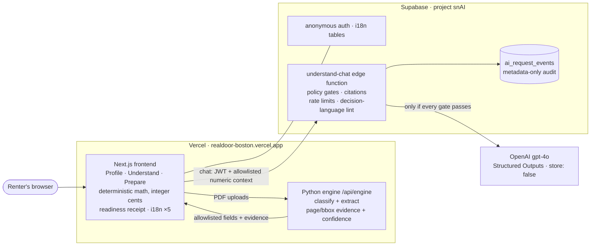

# RealDoor — Application-Readiness Copilot (Hack-Nation 2026, Challenge 03)

Renter-side copilot that turns household documents into a human-confirmed profile, explains one
affordable-housing program's rules with citations, flags missing or expired documents, and produces
a renter-controlled application-readiness packet. **It prepares and validates the application — it
never decides eligibility** (no approve / reject / score / rank / priority, ever).
Challenge brief: [`challenge_03.pdf`](challenge_03.pdf) · Live app:
**https://realdoor-boston.vercel.app**



*The red line everywhere in this diagram: no component ever labels a person eligible, approved,
denied, or ranked — the assistant refuses decision requests, and readiness always describes the
**file**, never the person.*

## How it works

**One applicant = one application record**, built entirely from uploaded documents. Three header
values recompute after **every** change: **Status** (phase ladder), **Gross Income** (deterministic,
integer cents), **Errors** (rule flags on confirmed values). All are readiness / accuracy /
completeness signals only — never a verdict. The flow is a strict three-phase pipeline (each step
unlocks the next):

1. **Profile** — drag in synthetic PDFs; each is classified against a live checklist (*uploaded* vs
   *still missing* — missing never hard-blocks). The engine extracts **only allowlisted fields**;
   the renter reviews them one at a time — each with the **source page and bounding box highlighted
   in the built-in PDF viewer**, a confidence score, and a plain-language explanation — then
   confirms, corrects, or types the value. **Only confirmed values are used downstream.** Injected
   document text is quarantined, never a field.
2. **Understand** — the income table shows every source annualized by its stated frequency
   (weekly ×52 … annual ×1) against the **frozen FY 2026 60% MTSP threshold** for the household
   size, with formula, effective date, and sources. A **bounded AI assistant** answers rules
   questions with `rule_id` citations and authority badges — greetings get a friendly reply,
   out-of-scope questions get a soft abstain with tappable suggestions, decision requests get a
   refusal.
3. **Prepare** — file readiness (`READY_TO_REVIEW` / `NEEDS_REVIEW`, about the **file**) with coded,
   evidence-linked reasons; a paper-style **SAMPLE readiness receipt** with in-place corrections and
   print-to-PDF; packet download (never transmitted); and delete-session with a deletion proof.

Cross-cutting: everything is reactive; the UI is **fully localized in five languages** (EN, ES, ZH,
TL, VI — the most spoken in the US), switchable at any time; the six official challenge households
reproduce the organizer oracle **exactly** through both the frontend and engine paths.

> The domain & safety law (red line, income math, readiness codes) lives in [`CLAUDE.md`](CLAUDE.md);
> the visual system in [`FRONTEND-DESIGN.md`](FRONTEND-DESIGN.md); the AI layer's contract,
> disclosure, and limits in [`AI_SPEC.md`](AI_SPEC.md); day-by-day decisions in
> [`BUILDLOG.md`](BUILDLOG.md).

## The AI assistant

A narrow, grounded chat panel in the Understand step, served by the Supabase Edge Function
[`supabase/functions/understand-chat`](supabase/functions/understand-chat):

- **Deterministic pre-gates** catch prompt injection, cross-applicant requests, protected-trait
  inference, legal advice, vacancy questions, wrong-year thresholds, decision requests, greetings,
  and "what are the rules?" — all without a model call.
- In-scope questions go to **OpenAI `gpt-4o`** (Responses API, Structured Outputs, `store: false`)
  with the frozen 11-rule corpus, an app guide, and an **allowlisted numeric context** — never
  files, raw OCR, names, addresses, or filenames. A server-side integrity gate independently
  recomputes all arithmetic before any model call.
- Answers must cite; uncited answers are downgraded, verdict language is lint-rejected, and every
  request is audited **metadata-only** in `ai_request_events` (RLS-denied to browsers) with per-user
  rate limits (5/min, 30/day). If the function or provider is down, a local frozen-rule fallback
  answers in the browser.

## Repository layout

```
frontend/   Next.js 16 app (App Router, strict TS) — pipeline UI, PDF viewer, AI chat,
            receipt, i18n; api/ carries the Python engine when deployed
engine/     Python extraction + rules engine (classify, extract, score) + fixtures/tests;
            deployed as a Vercel Python function at /api/engine/*
supabase/   understand-chat edge function + _shared policy/contract modules, tests
            (node --test), migrations (i18n, ai_request_events)
CLAUDE.md   project law · FRONTEND-DESIGN.md  design system · AI_SPEC.md  AI disclosure
```

## Hosting & services

- **Vercel** project `realdoor-boston` (team `chefcurrys-projects`) serves the frontend and the
  Python engine function. **Pushes do not auto-deploy** — deploy manually (below).
- **Supabase** project `snAI` (`zgfanoruqwftbqhhvtwg`, eu-central-1): anonymous auth, i18n tables,
  the `understand-chat` function, and the AI audit table. The URL + publishable key in
  `frontend/lib/supabase.ts` are public by design (anon-equivalent); real secrets
  (`OPENAI_API_KEY`, `OPENAI_MODEL`) live **only** in Supabase Edge Function secrets.

> Why the app isn't hosted on Supabase: the shared `*.supabase.co` domain rewrites `text/html` to
> `text/plain` (anti-phishing), so it can't serve web pages.

## Develop, test, deploy

```bash
cd frontend
npm install
npm run dev            # http://localhost:3000  (NEXT_PUBLIC_ENGINE=mock for engine-less preview)
npm run build          # must pass before pushing

# AI policy + eval suites (from the repo root; Node ≥ 22 runs TS natively)
node --test supabase/functions/tests/ai_policy.test.ts supabase/functions/tests/ai_eval.test.ts

./frontend/deploy.sh   # manual production deploy to Vercel (no alias step — domains are attached)
```

The engine's own tests and the six-household oracle fixtures live under `engine/tests/`.

## Ground rules for all frontend work

1. **Mobile friendly, always** — verified at 320 / 375 / 768 px, no horizontal overflow, touch
   targets ≥ 44px.
2. **WCAG 2.2 AA, always** — keyboard-complete, visible focus, labeled controls, no color-only
   signaling, live-region announcements, AA contrast on the warm palette.
3. **i18n is law** — every user-facing string ships in all five languages
   (`frontend/lib/dictionaries.ts` / `lib/pipeline/copy.ts`, mirrored in Supabase
   `i18n_translations`); never hardcode copy in components.
4. **Never-strings** — no decision / approval / eligibility language anywhere: UI, logs, exports,
   or model output. Refusals only, phrased in the negative.

## Local tooling (MCP)

[`.mcp.json`](.mcp.json) (machine-local, gitignored) wires **Playwright** (browser E2E / responsive
checks) and **Remotion** (programmatic demo video). Both run on demand via `npx …@latest`.
